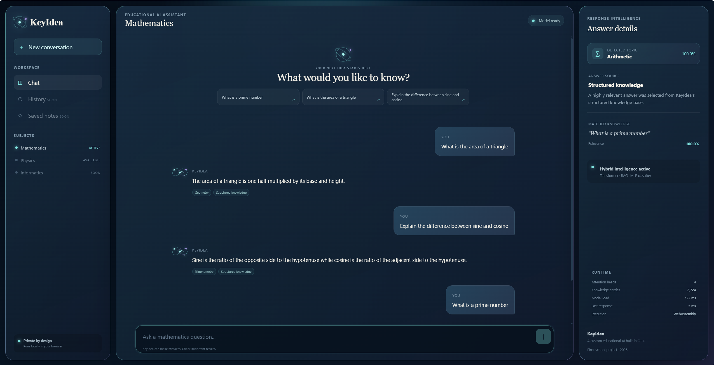

# KeyIdea — Educational AI

This repository hosts the public browser demo of **KeyIdea**, a privacy-focused educational AI assistant built from scratch in C++ and compiled to WebAssembly.

## [Open the live KeyIdea demo](https://toni31415.github.io/KeyIdea-Educational-AI/)

## What the demo shows

- Mathematics and physics question answering
- Hybrid responses using structured retrieval, a custom Transformer, and topic classifiers
- Topic, confidence, matched knowledge, and answer-source details
- Local execution in the browser through WebAssembly
- No external AI API and no server-side processing of questions

The neural-network framework, tensor system, automatic differentiation engine, BPE tokenizer, decoder-only Transformer, optimizers, RAG system, classifiers, training pipeline, and inference runtime were implemented specifically for this project.

## Privacy

After the static application files have loaded, questions are processed locally in the browser. KeyIdea does not send them to an external AI service.

## Source availability

This public repository contains the compiled demonstration only. The C++ source code, training code, tests, datasets, and development project files are intentionally not published.

KeyIdea is an educational prototype and can make mistakes. Important results should be checked.

Final school project, 2026.
